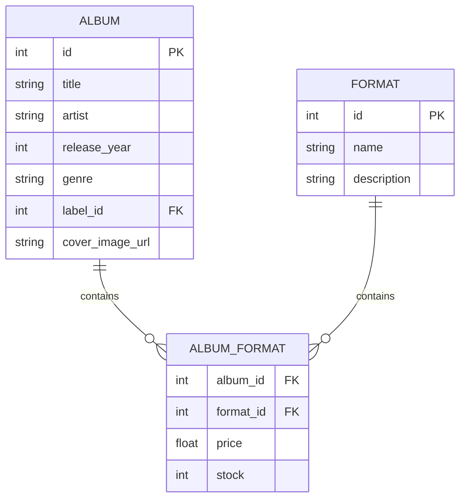

# Palmeras en la Mancha Records — Frontend

Frontend de la aplicación **Palmeras en la Mancha Records**, una aplicación web para gestionar y consultar un catálogo de discos físicos y sus filiales.

La interfaz se conecta con el backend desarrollado con FastAPI mediante peticiones HTTP y Axios.

---

## Índice

- [Descripción](#descripción)
- [Tecnologías](#tecnologías)
- [Arquitectura del frontend](#arquitectura-del-frontend)
- [Estructura del proyecto](#estructura-del-proyecto)
- [Requisitos previos](#requisitos-previos)
- [Instalación](#instalación)
- [Configuración](#configuración)
- [Variables de entorno](#variables-de-entorno)
- [Conexión con el backend](#conexión-con-el-backend)
- [Arquitectura de datos](#arquitectura-de-datos)
- [Diagrama DER](#diagrama-der)
- [Ejecución](#ejecución)
- [Documentación de endpoints](#documentación-de-endpoints)
  - [Albums](#albums)
  - [Formats](#formats)
  - [Branches](#branches)
  - [Labels](#labels)
- [Query parameters](#query-parameters)
- [Funcionalidades del frontend](#funcionalidades-del-frontend)
- [Cloudinary](#cloudinary)
- [Validación y calidad](#validación-y-calidad)
- [Buenas prácticas de desarrollo](#buenas-prácticas-de-desarrollo)

---

# Descripción

El frontend proporciona la interfaz gráfica de Palmeras en la Mancha Records.

La aplicación permite consultar el catálogo y gestionar diferentes recursos del sistema desde una interfaz web.

Las vistas principales son:

- **Visión General**
- **Catálogo Físico**
- **Filiales**

Además, incluye:

- creación de álbumes;
- edición de álbumes;
- eliminación de álbumes;
- creación de filiales;
- edición de filiales;
- eliminación de filiales;
- búsqueda de álbumes;
- filtros por género;
- filtros por discográfica;
- selección de tiendas;
- selección de formatos;
- previsualización de portadas;
- modales basados en el elemento HTML `<dialog>`.

---

# Tecnologías

## Frontend

- **HTML5**
- **CSS3**
- **JavaScript**
- **Axios**
- **Material Symbols**
- **Live Server** para desarrollo local

## Backend consumido

El frontend se comunica con una API REST desarrollada con:

- **FastAPI**
- **Python**
- **SQLAlchemy**
- **SQLite**

---

# Arquitectura del frontend

La aplicación utiliza JavaScript vanilla y carga las vistas dinámicamente.

La arquitectura principal es:

```text
index.html
    │
    ├── sidebar
    ├── header
    └── main-view
          │
          ▼
       router.js
          │
          ├── overview.html
          ├── catalog.html
          └── branches.html
```

Los scripts están organizados principalmente en:

```text
src/components/scripts/
```

Algunos de los módulos principales son:

```text
config.js
    ↓
Configuración de las URLs del backend

router.js
    ↓
Navegación y carga dinámica de vistas

catalog.js
    ↓
Catálogo, renderizado y filtros

modal.js
    ↓
Creación y edición de Albums

modal_options.js
    ↓
Opciones de formatos, géneros y discográficas

branches.js
    ↓
CRUD de filiales y modal de filiales

image_uploader.js
    ↓
Selección y previsualización de imágenes

overview.js
    ↓
Datos de la vista de visión general
```

---

# Estructura del proyecto

```text
frontend/
│
├── .gitignore
├── .vscode/
├── README.md
├── index.html
│
├── src/
│   │
│   ├── components/
│   │   └── scripts/
│   │       ├── branches.js
│   │       ├── catalog.js
│   │       ├── config.js
│   │       ├── image_uploader.js
│   │       ├── modal.js
│   │       ├── modal_options.js
│   │       ├── overview.js
│   │       └── router.js
│   │
│   ├── img/
│   │   └── dvd_placeholder.png
│   │
│   ├── js/
│   │   ├── albums.js
│   │   └── script.js
│   │
│   └── views/
│       ├── album_cards.html
│       ├── branches.html
│       ├── catalog.html
│       ├── header_component.html
│       ├── overview.html
│       ├── sidebar_component.html
│       │
│       └── styles/
│           ├── branches.css
│           ├── catalog.css
│           ├── header_component.css
│           ├── modal.css
│           ├── overview.css
│           ├── sidebar_component.css
│           └── styles.css
```

---

# Requisitos previos

Para ejecutar el frontend localmente se recomienda tener:

- **Git**
- **Visual Studio Code**
- Extensión **Live Server**
- Un navegador moderno
- El backend de Palmeras en la Mancha ejecutándose localmente

El frontend se comunica actualmente con:

```text
http://127.0.0.1:8000
```

por defecto.

---

# Instalación

## 1. Clonar el repositorio

```bash
git clone https://github.com/Palmeras-en-la-Mancha-Records/frontend.git
cd frontend
```

## 2. Abrir el proyecto en VS Code

```bash
code .
```

También puedes abrir la carpeta manualmente desde Visual Studio Code.

## 3. Instalar Live Server

En VS Code:

```text
Extensions
→ Live Server
→ Install
```

No es necesario instalar dependencias con `npm`, ya que el proyecto actual no utiliza un sistema de build basado en Node.js.

Axios se carga directamente mediante CDN desde `index.html`.

---

# Configuración

La configuración actual del frontend se encuentra en:

```text
src/components/scripts/config.js
```

Actualmente las URLs principales son:

```javascript
const ALBUMS_API_URL = "http://127.0.0.1:8000/albums/";
const DISCS_API_URL = ALBUMS_API_URL;
const FORMATS_API_URL = "http://127.0.0.1:8000/formats/";
const BRANCHES_API_URL = "http://127.0.0.1:8000/branches/";
```

Estas variables se exportan al objeto global `window`:

```javascript
window.ALBUMS_API_URL = ALBUMS_API_URL;
window.DISCS_API_URL = DISCS_API_URL;
window.FORMATS_API_URL = FORMATS_API_URL;
window.BRANCHES_API_URL = BRANCHES_API_URL;
```

---

# Variables de entorno

### Descripción

`API_BASE_URL`

URL base del backend.

```env
API_BASE_URL="http://127.0.0.1:8000"
```

`CLOUDINARY_CLOUD_NAME`

Nombre del cloud de Cloudinary.

```env
CLOUDINARY_CLOUD_NAME="your_cloud_name"
```

`CLOUDINARY_API_KEY`

API Key asociada a la cuenta de Cloudinary.

```env
CLOUDINARY_API_KEY="your_api_key"
```

`CLOUDINARY_API_SECRET`

API Secret de Cloudinary.

```env
CLOUDINARY_API_SECRET="your_api_secret"
```

`CLOUDINARY_UPLOAD_PRESET`

Preset de subida necesario si se utiliza un flujo de subida directa desde el frontend.

```env
CLOUDINARY_UPLOAD_PRESET="your_upload_preset"
```

> **No deben publicarse credenciales reales ni subirse `.env` al repositorio.**

---

# Conexión con el backend

El flujo general de comunicación es:

```text
┌────────────────────┐
│      Frontend      │
│ HTML/CSS/JS        │
└─────────┬──────────┘
          │
          │ Axios / HTTP
          ▼
┌────────────────────┐
│      FastAPI       │
│      Backend       │
└─────────┬──────────┘
          │
          │ SQLAlchemy
          ▼
┌────────────────────┐
│     SQLite DB      │
└────────────────────┘
```

Para que el frontend funcione correctamente en local, el backend debe estar ejecutándose.

Ejemplo:

```bash
uvicorn main:app --reload
```

---

# Arquitectura de datos

El frontend no contiene la base de datos.

La fuente de verdad de los datos es el backend.

Las entidades principales que consume son:

```text
Album
Format
Branch
Label
```

Actualmente el frontend trabaja principalmente con:

```text
Album
├── id
├── title
├── artist
├── release_year
├── genre
├── record_label
├── price
├── stock
├── format_id
└── cover_image_url
```

---

# Diagrama DER

El frontend consume el modelo de datos definido por el backend.

# Modelo previsto

La arquitectura final del proyecto contempla una relación N:M entre Albums y Formats.



El objetivo es permitir que un mismo álbum tenga diferentes ediciones:

```text
Álbum
├── Vinilo → 24.99 € → 10 unidades
├── CD     → 14.99 € → 20 unidades
└── Cassette → 12.99 € → 5 unidades
```

Esta estructura todavía está pendiente de integrarse completamente en el frontend y backend.

---

# Ejecución

## 1. Arrancar el backend

Desde el repositorio backend:

```bash
uvicorn main:app --reload
```

## 2. Abrir el frontend

En VS Code:

```text
index.html
→ botón derecho
→ Open with Live Server
```

La aplicación se abrirá normalmente en una dirección similar a:

```text
http://127.0.0.1:5500/
```

La dirección exacta puede cambiar según la configuración de Live Server.

---

# Navegación

El router principal es:

```text
src/components/scripts/router.js
```

Las vistas se cargan dinámicamente en:

```html
<main class="content" id="main-view">
```

Las principales vistas son:

```text
overview
catalog
branches
```

---

# Documentación de endpoints

El frontend utiliza una API REST.

La base URL de desarrollo es:

```text
http://127.0.0.1:8000
```

---

# Albums

## GET `/albums/`

Obtiene los álbumes.

El frontend utiliza este endpoint para cargar el catálogo y la visión general.

```http
GET http://127.0.0.1:8000/albums/
```

### Query parameters

El backend admite:

```text
search
genre
```

### Buscar por título

```http
GET /albums/?search=El%20Madrileño
```

### Buscar por artista

```http
GET /albums/?search=C.%20Tangana
```

### Filtrar por género

```http
GET /albums/?genre=Rock
```

### Combinar búsqueda y género

```http
GET /albums/?search=Tangana&genre=Pop
```

---

## GET `/albums/{album_id}`

Obtiene un álbum concreto.

Ejemplo:

```http
GET /albums/1
```

---

## POST `/albums/`

Crea un álbum.

Ejemplo:

```json
{
  "title": "El Madrileño",
  "artist": "C. Tangana",
  "release_year": 2021,
  "genre": "Pop / Fusión Urbana",
  "record_label": "Sony Music Spain",
  "price": 24.99,
  "stock": 10,
  "format_id": 1,
  "cover_image_url": "https://example.com/cover.jpg"
}
```

El frontend utiliza esta operación desde el modal de Albums.

---

## PUT `/albums/{album_id}`

Actualiza un álbum.

Ejemplo:

```http
PUT /albums/1
```

Body:

```json
{
  "title": "El Madrileño Deluxe",
  "price": 29.99,
  "stock": 15
}
```

---

## DELETE `/albums/{album_id}`

Elimina un álbum.

Ejemplo:

```http
DELETE /albums/1
```

---

# Formats

## GET `/formats/`

Obtiene todos los formatos.

```http
GET /formats/
```

El frontend utiliza este endpoint para cargar las opciones del selector de formatos.

---

## GET `/formats/{format_id}`

Ejemplo:

```http
GET /formats/1
```

---

## POST `/formats/`

Ejemplo:

```json
{
  "name": "Vinilo LP",
  "description": "Edición estándar en vinilo de 12 pulgadas"
}
```

---

## PUT `/formats/{format_id}`

Ejemplo:

```http
PUT /formats/1
```

```json
{
  "name": "Vinilo LP 180g"
}
```

---

## DELETE `/formats/{format_id}`

```http
DELETE /formats/1
```

---

# Branches

## GET `/branches/`

Obtiene todas las filiales.

```http
GET /branches/
```

El frontend utiliza este endpoint para:

- mostrar las filiales;
- mostrar el resumen de sedes;
- rellenar el selector de tiendas del catálogo.

---

## GET `/branches/{branch_id}`

Ejemplo:

```http
GET /branches/1
```

---

## POST `/branches/`

Crea una nueva filial.

Ejemplo:

```json
{
  "name": "Palmeras Records Centro",
  "address": "Calle Mayor 12",
  "phone": "+34 900 000 000"
}
```

---

## PUT `/branches/{branch_id}`

Actualiza una filial.

Ejemplo:

```json
{
  "name": "Palmeras Records Centro Norte",
  "phone": "+34 900 111 111"
}
```

---

## DELETE `/branches/{branch_id}`

Elimina una filial.

```http
DELETE /branches/1
```

---

# Labels

El backend dispone de endpoints para Labels:

```text
GET    /labels/
GET    /labels/{label_id}
POST   /labels/
PUT    /labels/{label_id}
DELETE /labels/{label_id}
```

Actualmente existen opciones de discográficas configuradas directamente en la interfaz.

---

# Query parameters

Los query parameters disponibles actualmente en Albums son:

| Parámetro | Tipo | Ejemplo | Función |
|---|---|---|---|
| `search` | string | `?search=Tangana` | Busca por título o artista |
| `genre` | string | `?genre=Rock` | Filtra por género |

## Ejemplo completo

```http
GET /albums/?search=Tangana&genre=Pop
```

---

# Funcionalidades del frontend

## Visión General

La pantalla principal muestra:

- últimos álbumes;
- resumen de filiales;
- accesos al catálogo;
- acceso a creación de Albums;
- acceso a creación de Filiales.

---

## Catálogo

El catálogo permite:

- cargar álbumes;
- mostrar portada;
- mostrar título;
- mostrar artista;
- mostrar género;
- mostrar año;
- mostrar discográfica;
- mostrar stock;
- mostrar precio;
- editar un álbum;
- eliminar un álbum;
- buscar;
- filtrar por género;
- filtrar por discográfica;
- seleccionar una tienda.

---

## Modal de Albums

El modal utiliza el elemento HTML:

```html
<dialog id="discModal">
```

Permite:

- crear un álbum;
- editar un álbum;
- cerrar el modal;
- seleccionar formato;
- seleccionar género;
- seleccionar discográfica;
- introducir precio;
- introducir stock;
- seleccionar una imagen.

El modal se controla mediante:

```javascript
showModal()
```

y:

```javascript
close()
```

---

## Modal de Filiales

El modal de Filiales también utiliza:

```html
<dialog id="branch-modal">
```

Permite:

- crear una filial;
- editar una filial;
- cancelar;
- cerrar haciendo clic en el fondo;
- guardar cambios.

---

# Gestión de imágenes

Actualmente:

```text
<input type="file">
        ↓
FileReader
        ↓
previsualización
```

El archivo se puede seleccionar y visualizar antes de guardar.

La lógica está en:

```text
src/components/scripts/image_uploader.js
```


---

# Cloudinary

La arquitectura prevista para imágenes es:

```text
Usuario
   │
   │ selecciona portada
   ▼
Frontend
   │
   │ archivo
   ▼
Backend / Cloudinary
   │
   │ URL pública
   ▼
Album.cover_image_url
```

Las variables previstas son:

```env
CLOUDINARY_CLOUD_NAME="your_cloud_name"
CLOUDINARY_API_KEY="your_api_key"
CLOUDINARY_API_SECRET="your_api_secret"
CLOUDINARY_UPLOAD_PRESET="your_upload_preset"
```

## Importante

No deben almacenarse credenciales reales dentro de:

```text
JavaScript
HTML
CSS
Git
```


Para el backend, las credenciales secretas deben permanecer siempre en variables de entorno del servidor.

---

# Validación y calidad

El frontend incorpora diferentes mecanismos para mejorar la calidad de la interfaz.

## Escape de HTML

Los datos renderizados dinámicamente pasan por una función de escape para evitar que valores recibidos desde la API se inserten directamente como HTML no controlado.

## Formularios

Los formularios utilizan validación HTML como:

```html
required
```

y tipos de campos específicos:

```html
type="number"
type="file"
```

## Prevención de envíos duplicados

Durante el guardado de Filiales, el botón se desactiva temporalmente:

```javascript
saveBtn.disabled = true;
```

Esto evita múltiples peticiones al realizar varios clics rápidamente.

## Manejo de errores

Las peticiones Axios están rodeadas de bloques `try/catch` y muestran mensajes al usuario o registran los errores en la consola.

---

# Calidad y buenas prácticas

El proyecto intenta mantener una separación básica de responsabilidades:

```text
HTML
 ↓
estructura de la interfaz

CSS
 ↓
presentación

JavaScript
 ↓
lógica de interacción y comunicación con API

Backend
 ↓
persistencia, validación y reglas de negocio
```

También se reutilizan funciones entre vistas, por ejemplo:

```text
modal.js
catalog.js
branches.js
router.js
```

y se utilizan componentes HTML dinámicos para navegación y vistas.

---

# Buenas prácticas de desarrollo

Antes de trabajar en una rama:

```bash
git switch dev
git pull origin dev
```

Crear una rama:

```bash
git switch -c nombre-de-la-rama
```

Comprobar los cambios:

```bash
git status
```

Guardar:

```bash
git add .
git commit -m "describe the change"
```

Subir:

```bash
git push -u origin nombre-de-la-rama
```

Después:

```text
Pull Request
      ↓
dev
```

---

# Flujo completo de la aplicación

```text
Usuario
   │
   ▼
Frontend
   │
   ├── Overview
   ├── Catalog
   └── Branches
   │
   ▼
Axios
   │
   ▼
FastAPI Backend
   │
   ├── Albums
   ├── Formats
   ├── Branches
   └── Labels
   │
   ▼
SQLAlchemy
   │
   ▼
SQLite
```

---

# Documentación adicional

Backend:

```text
https://github.com/Palmeras-en-la-Mancha-Records/backend
```

Frontend:

```text
https://github.com/Palmeras-en-la-Mancha-Records/frontend
```

Durante el desarrollo, la documentación interactiva del backend está disponible en:

```text
http://127.0.0.1:8000/docs
```

---

# Autoría

Proyecto académico desarrollado por el equipo de **Palmeras en la Mancha Records**.
